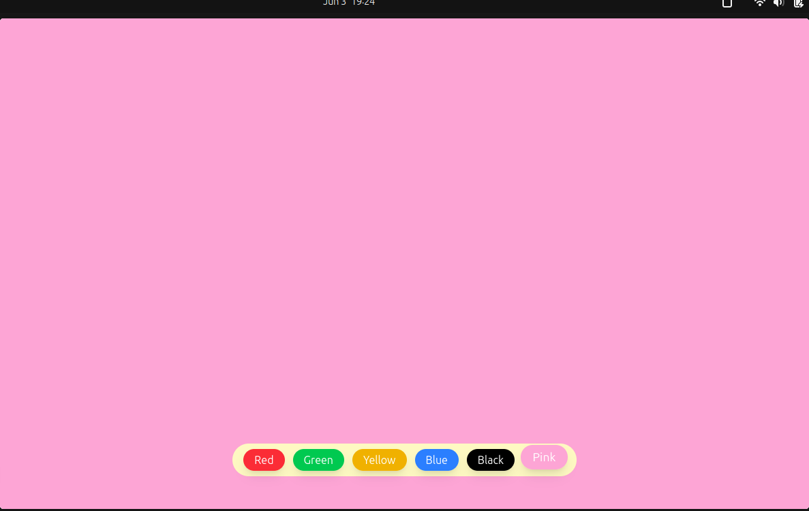

# 🎨 React Background Color Changer

This is a simple and responsive React app that allows users to dynamically change the background color of the screen by clicking on different buttons. Built using **React** and styled with **Tailwind CSS**, the project is beginner-friendly and focuses on **state management** and **user interaction**.

## 🚀 Features

* Change background color with one click
* Smooth animations using Tailwind's transition utilities
* Fixed button container for easy access
* Modern, responsive design

## 📸 Preview
 
 <!-- Add a screenshot if available -->

## 🛠️ Technologies Used

* **React**
* **Tailwind CSS**
* **JavaScript (ES6+)**

## 📂 Folder Structure

```
src/
├── App.css
├── App.jsx
├── main.jsx
└── index.css
```

## 🧑‍💻 Getting Started

### 1. Clone the repository

```bash
git clone https://github.com/yourusername/react-background-color-changer.git
cd react-background-color-changer
```

### 2. Install dependencies

```bash
npm install
```

### 3. Run the app

```bash
npm run dev
```

Open [http://localhost:5173](http://localhost:5173) in your browser to see the app.

## 🎯 Functionality

Each button sets a new background color using the `useState` hook. Colors include:

* Red
* Green (OKLCH)
* Yellow (OKLCH)
* Blue (OKLCH)
* Black
* Pink

All buttons are styled with Tailwind classes for hover effects and responsiveness.

## ✨ Customization

To add more colors:

1. Copy any existing `<button>` block.
2. Change the `onClick` color value and button styling.
3. Done!


---

**Enjoy experimenting with color and React!**
