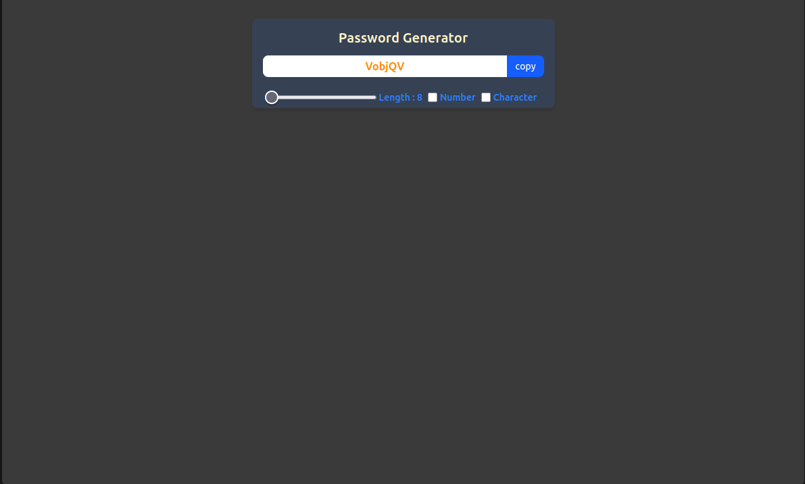

Sure! Here's your complete `README.md` file content for your **React Password Generator** project—all wrapped in one markdown file:

---

```markdown
# 🔐 React Password Generator

A simple and customizable password generator built using **React** and **Tailwind CSS**. Users can choose the length of the password and include numbers and special characters. One-click copy to clipboard functionality is also included.

---

## 🚀 Features

- 📏 Adjustable password length using a slider
- 🔢 Toggle inclusion of numbers
- 🧙‍♂️ Toggle inclusion of special characters
- 📋 One-click copy password to clipboard
- 🎨 Styled with Tailwind CSS

---

## 📸 Screenshot



> 💡 _Place your screenshot image in the `src/` folder and name it `screenshot.png`._

---

## 🛠️ Tech Stack

- **React** (with Hooks: `useState`, `useCallback`, `useRef`, `useEffect`)
- **Tailwind CSS** for styling

---

## 🧠 How It Works

- `passwordGenerator()` creates a new password every time options change.
- `ToClipboardcopyPassword()` copies the password to the clipboard using a `ref`.
- `useEffect()` watches changes in options and triggers password generation.

---

## 📁 Folder Structure

```

src/
├── App.jsx          # Main React component
├── App.css          # Tailwind base styles
├── main.jsx         # Entry point
└── screenshot.png   # Optional screenshot

````

---

## 🧾 Installation & Usage

1. **Clone the repository**
   ```bash
   git clone https://github.com/Ayan-css/learning-journey/tree/main/React/05passwordGenerator
   ```
   cd password-generator
````

2. **Install dependencies**

   ```bash
   npm install
   ```

3. **Start development server**

   ```bash
   npm run dev
   ```

4. **Open your browser**

   ```
   http://localhost:5173
   ```

---

## 🔧 Available Scripts

* `npm run dev` — Start the development server
* `npm run build` — Build the app for production
* `npm run preview` — Preview production build

---


## ✨ Author

Made with ❤️ by Ayan (https://github.com/Ayan-css)
Feel free to connect or contribute!

```
